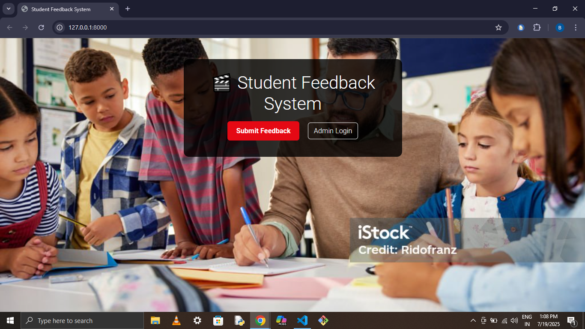
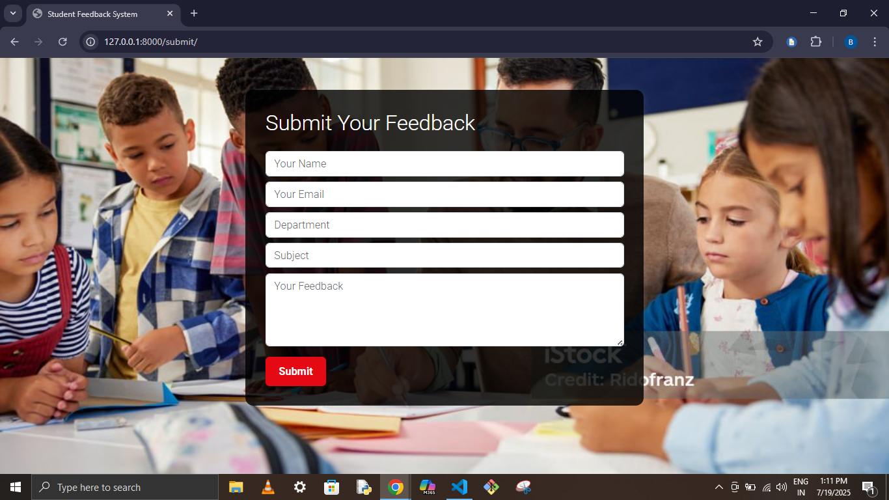
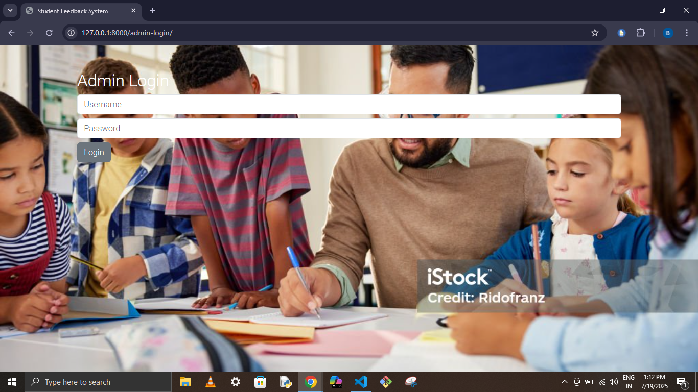
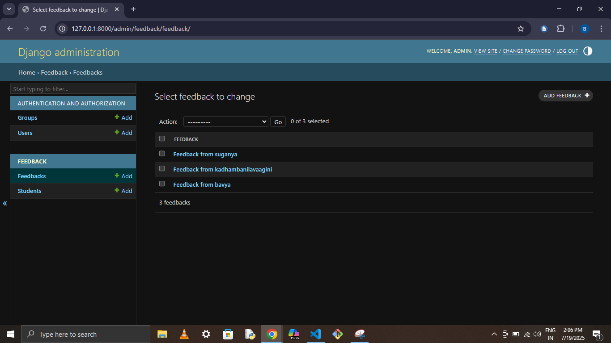

# 📝 Student Feedback Management System

A Django-based web application where students submit feedback and admins manage it via a dashboard.

## 🚀 Features
- Student feedback form
- Admin login and dashboard
- Django models and admin panel
- Bootstrap responsive UI

## 📂 Tech Stack
- Python 3, Django
- HTML, CSS, Bootstrap
- SQLite
- Git & GitHub

## 📷 Screenshots
(Add screenshots of your app UI)

## 💻 How to Run
```bash
git clone https://github.com/BAVYASRIM/student-feedback-system.git
cd student-feedback-system
python manage.py migrate
python manage.py runserver

## 📷 Screenshots

### 🏠 Home Page


### 📝 Feedback Form


### 🔐 Admin Login


### 📊 Admin Dashboard

